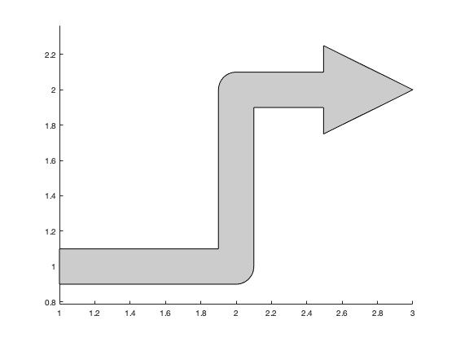

# arrowpolygon.m: arrow-shaped polygon


Author: Kelly Kearney


This repository includes the code for the `arrowpolygon.m` Matlab function, along with all dependent functions required to run it.


This function returns an arrow-shaped polygon along a specified input line, which can be easily plotted.  It uses coordinate space rather than pixel space for its calculations, so it looks best when used on an axis with a 1:1 aspect ratio.


## Contents

            
- Getting started        
- Syntax        
- Description        
- Examples        
- Contributions

## Getting started


**Prerequisites**


This function currently requires the Mapping Toolbox (due to its reliance on polybool.m).  The same calculations could be accomplished with the newer polyshape.m class, introduced in R2017b, but I haven't gotten around to updating this code yet.


**Downloading and installation**


This code can be downloaded from [Github](https://github.com/kakearney/arrowpolygon-pkg/) or the [MatlabCentral File Exchange](http://www.mathworks.com/matlabcentral/fileexchange/xxxx-example).  The File Exchange entry is updated daily from the GitHub repository.


**Matlab Search Path**


The following folders need to be added to your Matlab Search path (via `addpath`, `pathtool`, etc.):


```matlab
arrowpolygon/arrowpolygon
arrowpolygon/FEX-function_handle
```


## Syntax


```
[xout, yout] = arrowpolygon(x, y, width, headwidth, headlength)
[xout, yout] = arrowpolygon(x, y, width, headwidth, headlength, plotflag, usefast)
```


## Description


`[xout, yout] = arrowpolygon(x, y, width, headwidth, headlength)` calculates the x-coordinate `xout` and y-coordinates `yout` defining an arrowshaped polygon with centerline coordinate `x` and `y`, width `width`, arrow head width `headwidth`, and arrow head length `headlength`. All arrow measurements are defined in coordinate space.


`[xout, yout] = arrowpolygon(x, y, width, headwidth, headlength, plotflag)` turns on a debugging plot if the logical scalar `plotflag` is true.  Default is false.


`[xout, yout] = arrowpolygon(x, y, width, headwidth, headlength, plotflag, usefast)` uses an stripped down version of the polybool.m algorithm if the logical scalar `usefast` is true; this  can reduce computation time (at the cost of lest robust error-handling of improperly formatted inputs).  Default is false.


## Examples


```matlab
x = [1 2 2 3];
y = [1 1 2 2];

[xa, ya] = arrowpolygon(x, y, 0.2, 0.5, 0.5);
patch(xa,ya,ones(1,3)*0.8);
axis equal;
```





## Contributions


Community contributions to this package are welcome!


To report bugs, please submit [an issue](https://github.com/kakearney/arrowpolygon-pkg/issues) on GitHub and include:


  - your operating system
  - your version of Matlab and all relevant toolboxes (type `ver` at the Matlab command line to get this info)
  - code/data to reproduce the error or buggy behavior, and the full text of any error messages received

Please also feel free to submit enhancement requests, or to send pull requests (via GitHub) for bug fixes or new features.


I do monitor the MatlabCentral FileExchange entry for any issues raised in the comments, but would prefer to track issues on GitHub.


<sub>[Published with MATLAB R2019a]("http://www.mathworks.com/products/matlab/")</sub>
